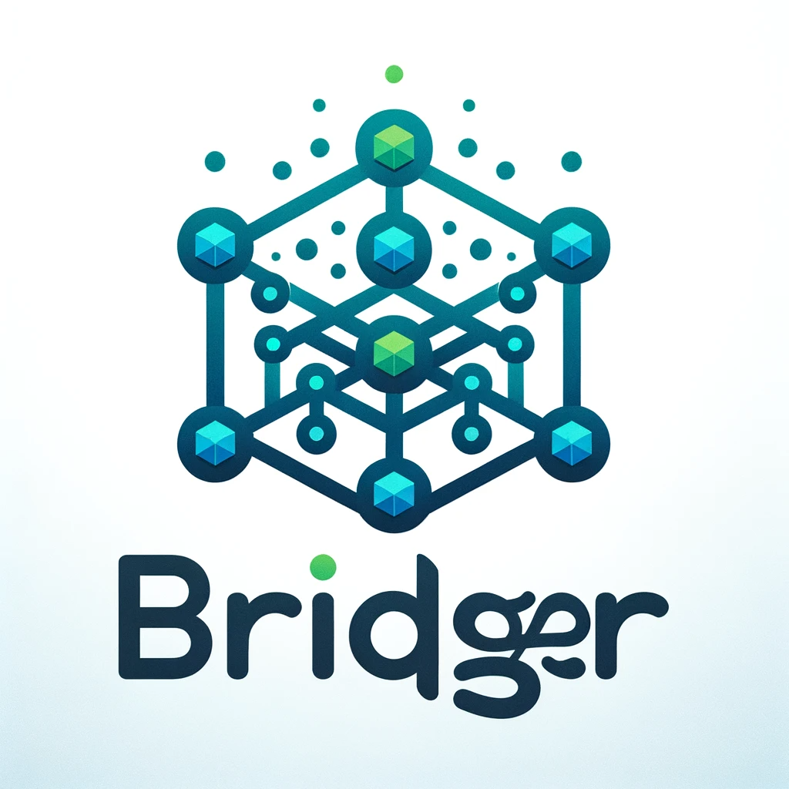

# Bridger



Bridger is a framework designed to support microservices architecture, enabling developers to easily build and manage microservices. This framework focuses on reducing the complexity of constructing and integrating microservices by allowing services to be registered and used in a manner similar to REST APIs. It provides a simplified approach to microservice development and management, streamlining the process of service deployment and communication within a distributed system.


Bridger fundamentally understands the multiplexing of gRPC and requires only one connection as a default. However, depending on the state of the application, a single connection might not be sufficient, or it could lead to overloading the target server. To address this, Bridger always provides a pool that can configure additional connections.

This feature ensures that even if Server A becomes overloaded and Server A2 is added for load balancing, the traffic does not continuously request Server A alone, due to its singleton nature. This mechanism helps in efficiently managing server loads and traffic distribution.


1. Use `go get` to install the latest version of the Bridger Client and Sever dependencies:

   ```shell
   go get -u github.com/sjy-dv/bridger@v0.0.1
   ```

2. Client Example:

```go
import (
	"log"
	"time"

	"github.com/sjy-dv/bridger/client"
	"github.com/sjy-dv/bridger/client/options"
)

func main() {
	/**
	default value
	if you want to singleton instance,
	min&max channel size should be set 1
	*/
	bridgerClient := client.RegisterBridgerClient(&options.Options{
		Addr:           "127.0.0.1:50051",
		MinChannelSize: 1,
		MaxChannelSize: 4,
		Timeout:        time.Duration(time.Second * 5),
	})
	defer bridgerClient.Close()
	type req struct {
		Msg string
	}
	val, err := bridgerClient.Dispatch("/greetings", &req{Msg: "Hello, Dispatcher"})
	if err != nil {
		panic(err)
	}
	response := &req{}
	err = client.Unmarshal(val, response)
	if err != nil {
		panic(err)
	}
	log.Println("First Message : ", response.Msg)
    // you can easily use metadata
	header := client.MetadataHeader{}
	header["name"] = "gopher"
	val, err = bridgerClient.Dispatch("/greetings/withname", &req{Msg: "I'm gopher"}, header)
	if err != nil {
		panic(err)
	}
	response = &req{}
	err = client.Unmarshal(val, response)
	if err != nil {
		panic(err)
	}
	log.Println("Second Message : ", response.Msg)
}
```

3. Server Example:

```go
import (
	"github.com/sjy-dv/bridger/server"
	"github.com/sjy-dv/bridger/server/dispatcher"
	"github.com/sjy-dv/bridger/server/options"
)

func main() {
	bridger := server.New()
    // you can use register function like rest api
	bridger.Register("/greetings", greetings)
	bridger.Register("/greetings/withname",
		greetingsWithHeaderName,
		"is using metadata api")
	bridger.RegisterBridgerServer(&options.Options{
		Port:                         50051,
		ChainUnaryInterceptorLogger:  true,
		ChainStreamInterceptorLogger: true,
	})
}

func greetings(dtx dispatcher.DispatchContext) *dispatcher.ResponseWriter {
	var (
		req = struct {
			Msg string
		}{}
		err error
	)
	err = dtx.Bind(&req)
	if err != nil {
		return dtx.Error(err)
	}
	req.Msg = req.Msg + "\n" + "Me too.."
	return dtx.Reply(&req)
}

func greetingsWithHeaderName(dtx dispatcher.DispatchContext) *dispatcher.ResponseWriter {
	var (
		req = struct {
			Msg string
		}{}
		err error
	)
	err = dtx.Bind(&req)
	if err != nil {
		return dtx.Error(err)
	}
	name := dtx.GetMetadata("name")
	req.Msg = "Hello " + name
	return dtx.Reply(&req)
}
```